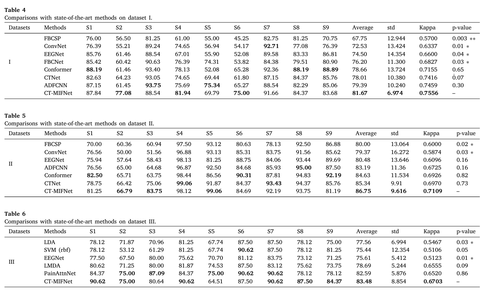

# **CT-MIFNet: Convolutional Transformer-based Multi-View Interaction and Fusion Network for EEG Decoding [(paper)](https://www.sciencedirect.com/science/article/abs/pii/S1746809425009322)**

This repository provides the implementation of **CT-MIFNet**, a deep learning model based on CNN and Transformer, which enhances model performance by interacting with and fusing information from different views.

---

## **Features**
- A novel parallel dual-branch convolutional Transformer-based multi-view
interaction and fusion network is proposed for EEG decoding.

- A cross-covariance attention mechanism is introduced to facilitate feature
interaction and fusion across diverse perspectives while reducing computational
load.
- Extensive comparisons with the state-of-the-art models on three datasets with two
distinct BCI paradigms demonstrate the generalization and robustness of the
proposed model.



---

## **Project Structure**
```
CT-MIFNet/  
|—— prcessing/                                
    └── BCI_2a_getData.m                    # Script for extraction and preprocessing of 2a dataset  
    └── BCI_2b_getData.m                    # Script for extraction and preprocessing of 2b dataset  
|—— commom_spatial_pattern.py               # CSP function of the 2a dataset  
|—— commom_spatial_pattern_2b.py            # CSP function of the 2b dataset  
|—— config.py                               # Global configuration file for the 2a dataset project  
|—— config_2b.py                            # Global configuration file for the 2b dataset project  
|—— CT_MIFNet.py                            # Including CT-MIFNet and model training framework applied to 2a dataset  
|—— CT_MIFNet_2b.py                         # Including CT-MIFNet and model training framework applied to 2b dataset  
|—— Figure_01.png                           # CT-MIFNetm model framework diagram  
|—— Figure_04.png                           # Comparison chart of results between CT-MIFNetm and other models on three datasets  
|—— LICENSE                                 # License file  
|—— metric.py                               # Including custom functions such as FFT and LabelSmoothingLoss  
```
---

## **File Descriptions**

### 1.prcessing file  
- Execute ```BCI_2a_getData.m``` in Matlab to extract and preprocess the 2a dataset.
- Execute ```BCI_2a_getData_2b.m``` in Matlab to extract and preprocess the 2b dataset.

### 2.```commom_spatial_pattern.py``` and ```commom_spatial_pattern_2b.py```.
- Script for implementing multi-class CSP.
  
### 3. ```config.py``` and ```config_2b.py```
A centralized file for managing global configurations, including:
- Parameter settings for the dataset (e.g. number of channels, time points, sampling frequency)
- Model hyperparameters (e.g., embedding dimensions, attention heads).
- Training parameters (e.g., batch size, epochs, learning rate，num_class).

### 4.```CT_MIFNet.py``` and ```CT_MIFNet_2b.py```.
Contains three main modules: ```CT_MIFNet()```, ```Trans()``` and ```main()```.
- ```CT_MIFNet()``` is the core implementation of the model.
- ```Trans()``` implements training and evaluation logic.
- ```Main()``` is used to configure the environment (random seed), create instances of the Trans() class, and perform training for each subject

---

## **Supported Datasets**
CT_MIFNet supports two EEG datasets and one Pain Percept dataset. Below are the recommended settings:  
### 1.BCI Competition IV dataset 2a
- Model Initialization：```CT_MIFNet()```
- Key Parameters:```classes=4```
### 2.BCI Competition IV dataset 2b  
- Model Initialization：```CT_MIFNet()```
- Key Parameters: ```classes=2```
### 3.EDLEP dataset

---


## **Usage**

You can directly run the model files TFCformer.py and TFCformer_2b.py. We will update the descriptions for some files shortly after our paper is accepted.

---

## Notice
1.If you apply CT-MIFNet to other paradigms besides Motor Imagery, we recommend that you remove the CSP module. Based on our experiments in the Pain Perception paradigm, we found that the CSP had a negative impact on the model.


2.Dataset III will be made public soon. At that time, we will release the code of CT-MIFNet on Dataset III.


---


## **Citation**
Hope this code can be useful. I would appreciate you citing us in your paper. 
```
@article{XIONG2026108421,
title = {CT-MIFNet: Convolutional transformer-based multi-view interaction and fusion network for EEG decoding},
journal = {Biomedical Signal Processing and Control},
volume = {112},
pages = {108421},
year = {2026},
issn = {1746-8094},
doi = {https://doi.org/10.1016/j.bspc.2025.108421},
url = {https://www.sciencedirect.com/science/article/pii/S1746809425009322},
author = {Yibo Xiong and Jinming Li and Yun Zhuang and Xiangyue Zhao and Yilu Xu and Lilin Jie},
keywords = {Brain-computer interface, Motor Imagery, Pain Perception, Transformer, Multi-view Information, Feature Interaction and Fusion},
abstract = {Convolutional neural networks (CNNs) are effective at extracting local features but are limited in capturing long-term dependencies due to their fixed kernel size. In contrast, Transformers are capable of capturing long-range dependencies through the self-attention mechanism.Although there are frameworks that extract both local and global features by combining CNN with Transformer in brain-computer interface (BCI) systems, multi-view features have not been effectively explored in Electroencephalography (EEG) decoding. Moreover, the increased computational complexity introduced by the attention mechanism in Transformers poses challenges, hindering their application to EEG signals with long sequence. Therefore, a novel Convolutional Transformer-based multi-view Interaction and Fusion Network (CT-MIFNet) is proposed. Initially, the preprocessed EEG signals are passed through a spatial transformation module, which reduces dimensionality while minimizing noise. After undergoing fast fourier transform (FFT) and branching into two separate paths, the signals are input into a Patch Embedding module with multi-scale convolution mapping to extract temporal, frequency, and spatial features. Subsequently, to enhance feature representations, these local features are processed by the Transformer-based Feature Interaction and Fusion module, which leverages Cross-Covariance Attention (CCA) to reduce computational complexity while facilitating the exchange and fusion of feature tokens from various perspectives. Extensive experiments showed that CT-MIFNet demonstrated the superior performance and generalization ability on the BCI Competition IV-2a, BCI Competition IV-2b, and the EEG datasets for laser-evoked pain datasets, achieving accuracies of 81.67%, 86.75%, and 83.48%, respectively. To enhance model interpretability, t-distributed stochastic neighbor embedding (t-SNE) and heatmap were employed for visualization. The code is available at https://github.com/XCZchaos/CT-MIFNet.git.}
}
```
---

## **Contact**
For questions or issues, please open an issue or contact:
<a href="mailto:asherxiong552@gmail.com">📧 asherxiong552@gmail.com</a>
