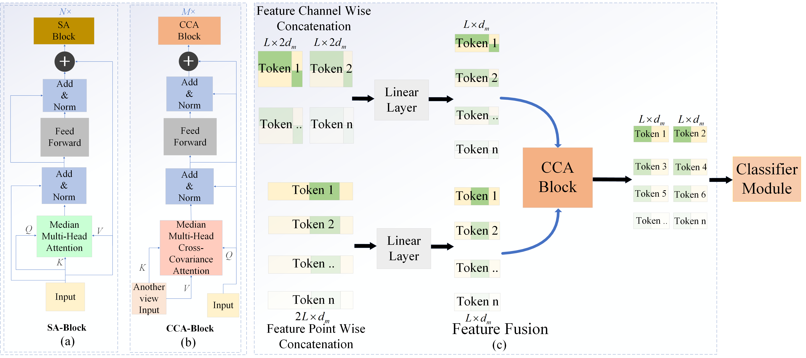

# **CT-MIFNet: Convolutional Transformer-based Multi-View Interaction and Fusion Network for EEG Decoding**

This repository provides the implementation of **CT-MIFNet**, a deep learning model based on CNN and Transformer, which enhances model performance by interacting with and fusing information from different views.

---

## **Features**
- A novel parallel dual-branch convolutional Transformer-based multi-view
interaction and fusion network is proposed for EEG decoding.

- A cross-covariance attention mechanism is introduced to facilitate feature
interaction and fusion across diverse perspectives while reducing computational
load.
- Extensive comparisons with the state-of-the-art models on three datasets with two
distinct BCI paradigms demonstrate the generalization and robustness of the
proposed model.

---

## Usage
You can directly run the model files TFCformer.py and TFCformer_2b.py. We will update the descriptions for this project shortly after our paper is accepted.

## Contact
For questions or issues, please open an issue or contact:
<a href="mailto:asherxiong552@gmail.com">📧 asherxiong552@gmail.com</a>
